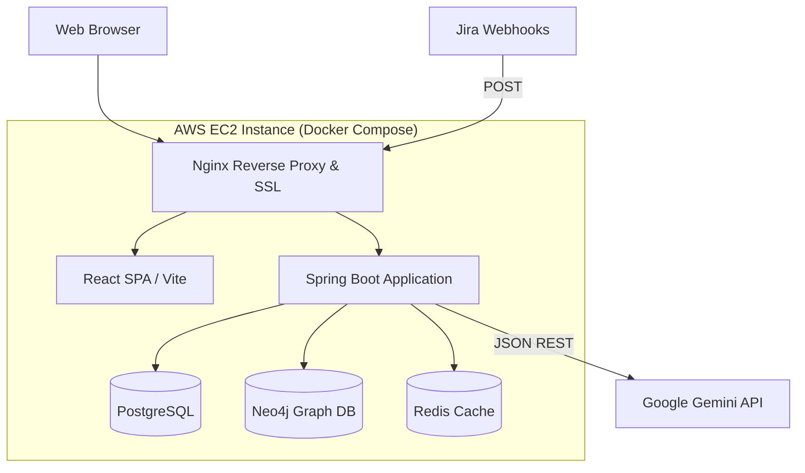

# DeliveryFlow - System Architecture

**Document ID:** DF-ARCH-01  
**Target Audience:** Solution Architects, DevOps, Full-Stack Developers

This document defines the overarching system architecture for DeliveryFlow, designed specifically for a solo-developer execution while adhering to enterprise standards.

---

## 1. High-Level Architecture Diagram (Logical)

---

## 2. Frontend Architecture
- **Framework:** React 18, bootstrapped via Vite for lightning-fast HMR (Hot Module Replacement) and optimized build times.
- **Language:** TypeScript (Strict mode enabled).
- **Styling:** TailwindCSS for utility-first styling.
- **Component Library:** Shadcn/UI for accessible, unstyled components that we can fully customize without being locked into a vendor's design system.
- **State Management:** 
  - **Server State:** TanStack Query (React Query) handles caching, background fetching, and deduplication of API requests.
  - **Client State:** React Context API for global state (Auth, Theme).
- **Data Visualization:**
  - **Graph:** React Flow (for the interactive dependency DAG).
  - **Charts:** Recharts (for Health Score gauges, Burndowns, and Analytics).
  - **Tables:** AG Grid (Community Edition) for handling massive datasets with sorting/filtering built-in.

---

## 3. Backend Architecture
- **Framework:** Spring Boot 3.x (Java 21).
- **Paradigm:** Modular Monolith enforced via `Spring Modulith`.
- **Security:** Spring Security with stateless JWT (JSON Web Tokens). No HTTP sessions are stored on the server.
- **API Paradigm:** RESTful JSON APIs. 
- **Observability:** OpenTelemetry (OTel) agent injected into the JVM. Traces are captured for every incoming HTTP request and passed down to database queries.

### Domain Boundaries
1. **Core:** Authentication, JWT validation, exception handling, and shared DTOs.
2. **PMO:** The relational domain. Handles Projects, Teams, Tasks, and Sprints. Interfaces exclusively with PostgreSQL.
3. **Intelligence:** The graph domain. Interfaces with Neo4j. Receives Spring Events from the PMO domain to maintain consistency.
4. **Analytics:** The math engine. Calculates Health Scores based on data polled from PMO and Intelligence.
5. **AI:** The LangGraph orchestrator. Constructs RAG contexts and queries the Gemini API.

---

## 4. Infrastructure & DevOps
- **Deployment Strategy:** Single AWS EC2 Instance (`t3.medium` or `t3.large`).
- **Containerization:** Docker Compose manages the local and production multi-container setup, ensuring environmental parity.
- **Reverse Proxy:** Nginx handles incoming HTTP/HTTPS traffic, terminating SSL (via Let's Encrypt / Certbot) and routing `/api/*` to the Spring container and all other routes to the React container.
- **CI/CD:** GitHub Actions.
  - *Trigger:* Push to `main`.
  - *Pipeline:* Run Tests -> Build React Dist -> Build Spring `.jar` -> Build Docker Images -> SSH to EC2 -> Pull and `docker-compose up -d`.
